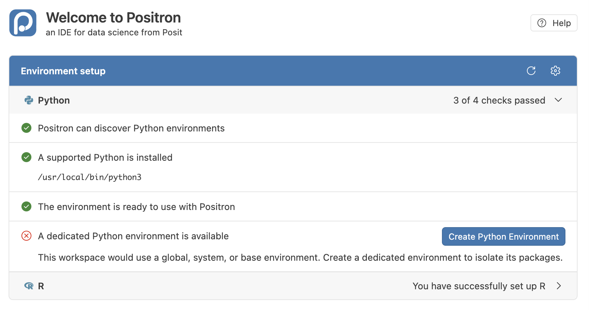

# MY472 — Setting up Python on your computer

In this course, you will write Python code inside Quarto notebooks (`.qmd` files). We will cover this in more detail in week 1 lecture, but this guide sets up everything you need to run this code on your own laptop.

Try to complete the entire guide **before your Week 1 seminar**. Ideally, your final test will report **`ALL CHECKS PASSED`**. Week 1 includes the complete setup material, so students who join late or encounter problems can finish it during the seminar.

> [!CAUTION]
> This guide has been fully tested on macOS. The Windows instructions cover the standard PowerShell setup, but some steps may vary depending on your existing configuration. The Linux instructions have not been tested, but Linux setup should be similar to macOS.

## What you will set up

You will install:

1. **Positron** — the editor in which you will write and run code.
2. **Python 3.13.15** — the programming language used in this course.
3. **Quarto** — turns a `.qmd` notebook into a readable document.
4. **Git** — receives course materials and saves your work to GitHub.

You will also create one Python environment containing the packages used in MY472. The same environment will serve every seminar throughout the course.

## Before you start

### Using the command line

The [command line](https://en.wikipedia.org/wiki/Command-line_interface) is a way of controlling your computer by typing commands. You enter these commands in a [terminal emulator](https://en.wikipedia.org/wiki/Terminal_emulator), usually just called a "terminal." The terminal runs a program called a "shell," which interprets your commands. You will use it several times in this guide, but you do not need any previous experience. The week 1 lecture will cover this.

After installing Positron in Step 1, you will use Positron's built-in terminal for the rest of this guide. For its shell, Positron's terminal normally uses PowerShell on Windows, zsh on macOS and Bash on Linux.

Most of the time, we use `monospaced` text to indicate computing concepts, such as commands, code, file names, etc. When this guide shows a command on its own line, type or paste it into the terminal and press **Enter**. Wait for it to finish before running the next command. For example, this command will print the word Hello:

```text
echo "Hello"
```

Monospaced text inside a sentence, like `this`, may refer to a command, file, folder or error message. You do not need to run it unless the guide tells you to.

### When something goes wrong

Installing and maintaining software is part of working in data science. If something goes wrong:

1. Read the complete error message.
2. Follow the troubleshooting link beneath the current step.
3. Search the web for the exact error or ask an AI assistant. Include your operating system and the step you are following.
4. Read suggested commands before running them. Be cautious if they conflict with the Python version, folder structure or software specified in this guide.

You are not expected to solve every problem alone. If you are still stuck after making a reasonable attempt, ask for help and include the exact error message and what you have already tried.

> [!NOTE]
> **Know where to get help**
>
> If you need help at any point, see [Get help](README.md#get-help) for current drop-in sessions and other ways to contact the teaching team. Include the exact error message and explain what you have already tried.

## Step 1 — Install Positron

Download and install [Positron](https://positron.posit.co/download) for your operating system. Open it once to confirm that it starts.

**Success:** Positron opens normally.

**If not:** See [Troubleshooting: installing Positron](#step-1-installing-positron).

## Step 2 — Create your course folder

In Positron, select **Terminal → New Terminal**. Run:

```text
cd ~
pwd
```

**Stop and check the output from `pwd` before continuing.** It must show your home directory:

- **macOS:** `/Users/<your-user-name>`
- **Windows:** `C:\Users\<your-user-name>`
- **Linux:** `/home/<your-user-name>`

If it shows another location, do not create the course folder. See [Troubleshooting: the course folder](#step-2-the-course-folder).

Once you have confirmed that you are in your home directory, run:

```text
mkdir LSE-MY472-AT26
cd LSE-MY472-AT26
pwd
```

If `mkdir` says that the folder already exists, continue with `cd LSE-MY472-AT26`; do not create a second course folder.

The final `pwd` output must end with `LSE-MY472-AT26`.

We will assume throughout the term that you use this folder name and location.

If you have a specific reason to use another local folder, you may do so, but it must not be cloud-synced. You will need to adapt every path and folder reference in the course materials yourself.

> [!WARNING]
> Do not place the course folder inside iCloud, OneDrive, Dropbox or Google Drive. Cloud syncing can damage or confuse the Python environment.
>
> Be careful with folders that may be synced automatically. On macOS, Desktop and Documents are often synced to iCloud. On Windows, they are often synced to OneDrive.

You will protect your work by committing and pushing it to GitHub regularly, using the workflow taught in Week 1.

By the end of setup and as seminar materials are added, the folder will come to look like this:

```text
LSE-MY472-AT26/
├── .venv/
├── requirements.txt
├── setup-test.qmd
├── at26-s01-<username>/
├── at26-s02-<username>/
└── ...
```

In Positron, select **File → Open Folder…** and choose `LSE-MY472-AT26`.

> [!NOTE]
> **Trusted folders**
>
> The first time you open a folder in Positron, it may ask you to confirm that you trust the folder. You should choose to trust your `LSE-MY472-AT26` folder. Sometimes, Positron does not ask you, and opens in "Restricted Mode." If so, you will see a grey bar toward the top of the app with a button called "Manage." Click Manage and then select "Trust." If you do not do this, Positron will severely limit your ability to work with files in this folder.

Always open the main course folder `LSE-MY472-AT26` rather than any subfolder contained within it. Positron uses the main folder to find the shared course environment.

**Success:** Positron has `LSE-MY472-AT26` open as the main folder.

**If not:** See [Troubleshooting: the course folder](#step-2-the-course-folder).

## Step 3 — Install Python, Quarto and Git

Install the following software from the official websites:

| Software | Download | Purpose |
|---|---|---|
| **Python 3.13.15** | [Python 3.13.15](https://www.python.org/downloads/release/python-31315/) | The programming language |
| **Quarto** | [Quarto installation](https://quarto.org/docs/get-started/) | Runs and renders `.qmd` notebooks |
| **Git** | [Git downloads](https://git-scm.com/downloads) | Manages course materials and your work |

Use **Python 3.13.15**, rather than whichever version is described as "latest." Using the same version makes problems easier to reproduce and solve.

When an installation page offers several options, choose the installer for your operating system and accept its default settings unless this guide says otherwise.

### macOS

Use the installers linked in the table.

After installing Python, open **Applications → Python 3.13** in Finder and double-click **Install Certificates.command**. Python may otherwise fail when it tries to make secure connections to websites.

Git may already be installed. In the Positron terminal, run `git --version`. If it prints a version number, Git is ready. If macOS asks to install the command-line developer tools, select **Install**; these tools include Git and are sufficient for this course. If the terminal instead displays an error and no installation prompt appears, install Git using the link in the table above.

### Windows

Install the Python install manager from the Microsoft Store or by running this command in the Positron terminal:

```powershell
winget install 9NQ7512CXL7T
```

Then install the exact course version of Python:

```powershell
py install 3.13.15
```

Install Quarto and Git using the links in the table.

Windows now uses the Python install manager rather than the older standalone installer, so you may not see an "Add python.exe to PATH" option.

### Linux

Install Python **3.13.15** and its `venv` module. On Debian or Ubuntu, `venv` may be provided as a separate `python3.13-venv` package.

If your distribution’s official instructions do not offer Python 3.13.15 and its `venv` module, stop and ask the teaching team for help rather than installing another Python version. Install Quarto and Git using the official instructions linked in the table.

### Check your installation

After installing everything, quit Positron completely. Use **Positron → Quit Positron** on macOS, or close all Positron windows on Windows and Linux. Then reopen it so that it detects the new software. Reopen `LSE-MY472-AT26`, then select **Terminal → New Terminal**.

On macOS or Linux, run:

```bash
python3.13 --version
quarto --version
git --version
```

On Windows, run:

```powershell
py -V:3.13.15 --version
quarto --version
git --version
```

Each command should print a version number. Python must report **`Python 3.13.15`**.

**Success:** Python reports version 3.13.15, and Quarto and Git each report a version.

**If not:** See [Troubleshooting: installing Python, Quarto and Git](#step-3-installing-python-quarto-and-git).

## Step 4 — Create the course environment

You do this once for the whole course.

In Positron, select **Terminal → New Terminal**. Run `pwd` and continue only if its output ends with `LSE-MY472-AT26`. (If it doesn't, you need to open the folder in Positron by selecting **File → Open Folder…** and choosing `LSE-MY472-AT26`.)

Once the output from `pwd` ends with `LSE-MY472-AT26`, proceed.

### macOS and Linux

Run the following:

```bash
python3.13 -m venv .venv
source .venv/bin/activate
```

### Windows

Run:

```powershell
py -V:3.13.15 -m venv .venv
.\.venv\Scripts\Activate.ps1
```

We specify Python 3.13.15 so the environment does not silently change if your computer later installs another Python version.

**Success:** Your terminal prompt begins with `(.venv)`.

**If not:** See [Troubleshooting: creating the environment](#step-4-creating-the-environment).

## Step 5 — Complete the Python setup in Positron

Activating `.venv` in the terminal does not automatically tell Positron to use it for its Console and notebooks.

1. Select **Help → Welcome**.
2. Under **Environment setup**, expand the **Python** section.

You should see four sections. In most cases, the first three sections will have green checkmarks and the last section will have a red X. For example:



If this is what you see, then:

3. Select **Use Existing** from the drop-down menu that appears at the top of the page.
4. Press the refresh button on the top right of the blue "Environment setup" panel.

**Success:** The Python section reports **4 of 4 checks passed** and under "A supported Python is installed", you see a path that ends with `LSE-MY472-AT26/.venv/bin/python`.

**If not:** See [Troubleshooting: completing the Python setup](#step-5-completing-the-python-setup-in-positron).

## Step 6 — Install the course packages

Download [`requirements.txt`](requirements.txt) into `LSE-MY472-AT26`. In Positron's file list, confirm that it appears directly inside the main folder with the exact name `requirements.txt`.

In the Positron terminal, confirm that `(.venv)` appears at the beginning of the prompt. If it does not, run the activation command from Step 4 before continuing. Then run:

```bash
python -m pip install --upgrade pip
python -m pip install -r requirements.txt
```

This installs the package versions used in the course.

**Success:** The terminal prompt returns after each command, and neither command ends with a line beginning `ERROR`. The commands may print many lines and take several minutes.

**If not:** See [Troubleshooting: installing packages](#step-6-installing-packages).

## Step 7 — Run the setup test

Download [`setup-test.qmd`](setup-test.qmd) into the same folder. In Positron's file list, confirm the exact name `setup-test.qmd`.

Open the file in Positron and select **Preview** at the top of the file.

After a few seconds, a page should open on the right with output beneath every section, including a small scatterplot.

**Success:** The final section reports **`ALL CHECKS PASSED`**.

**If not:** See [Troubleshooting: the setup test](#step-7-the-setup-test).

## Troubleshooting

Start with the section corresponding to the step where the problem occurred.

When this guide says to delete `.venv`, use Positron's file list. Right-click the `.venv` folder directly inside `LSE-MY472-AT26` and select **Delete**. Do not delete the main course folder.

### Step 1: Installing Positron

If Positron does not install or open, confirm that you downloaded the correct installer for your operating system and processor from the [Positron download page](https://positron.posit.co/download). Restart your computer and try opening Positron again.

### Step 2: The course folder

| What you see | What it means | What to do |
|---|---|---|
| `pwd` does not show your home directory after `cd ~` | The terminal is not using the expected home location | Stop without creating the folder and ask for help |
| Positron is using the wrong folder | An individual seminar folder was opened instead of the main course folder | Select **File → Open Folder…** and open `LSE-MY472-AT26` |
| Strange errors appear after moving or syncing the folder | The environment was moved or altered by a cloud-sync service | Move the course folder to the correct local location, delete `.venv`, and repeat Steps 4–6 |

### Step 3: Installing Python, Quarto and Git

| What you see | What it means | What to do |
|---|---|---|
| `python3.13` or `py -V:3.13.15` is not recognised | Python 3.13.15 is missing or Positron was open during installation | Fully quit and reopen Positron; if the command still fails, install Python again |
| Python reports another version | The wrong Python release was installed or selected | Install Python 3.13.15 and repeat the version check |
| `quarto` is not recognised | Quarto is missing or Positron was open during installation | Fully quit and reopen Positron; if the command still fails, install Quarto again |
| `git` is not recognised | Git is missing or Positron was open during installation | Fully quit and reopen Positron; if the command still fails, install Git again |
| `CERTIFICATE_VERIFY_FAILED` on macOS | Python's security certificates were not installed | Run **Install Certificates.command** from **Applications → Python 3.13** |

### Step 4: Creating the environment

| What you see | What it means | What to do |
|---|---|---|
| Windows reports that running scripts is disabled | PowerShell has blocked the activation script | Run `Set-ExecutionPolicy -Scope Process -ExecutionPolicy RemoteSigned`, then activate the environment again |
| The terminal prompt begins with `(base)` | A conda environment has been activated automatically | Run `conda deactivate`, then activate the course `.venv` using the command in Step 4 |
| The `(.venv)` prefix does not appear | The environment is not active in this terminal | Run the activation command from Step 4 again |
| The setup test later reports the wrong Python version | `.venv` was created using another Python version | Delete `.venv` and repeat Steps 4–6 using Python 3.13.15 |

### Step 5: Completing the Python setup in Positron

If `.venv` is missing from the environment list, select the refresh icon in the **Environment setup** panel. If it is still missing:

1. Open the command palette, type **Python: Select Interpreter**, then select that command.
2. Select **Enter interpreter path…**, then **Find…**.
3. Choose:

   - **macOS and Linux:** `.venv/bin/python`
   - **Windows:** `.venv\Scripts\python.exe`

On macOS, if `.venv` is hidden in the file chooser, press `Cmd`+`Shift`+`.` to show hidden files.

If Positron remains stuck on "Discovering interpreters…", open the command palette and run **Developer: Reload Window**, then return to **Help → Welcome** and try again.

If Positron also lists conda environments used for another course, select the interpreter inside `LSE-MY472-AT26/.venv`.

### Step 6: Installing packages

| What you see | What it means | What to do |
|---|---|---|
| `FAIL Package: …` | A required package is not installed | Activate `.venv` and repeat Step 6 |
| `ModuleNotFoundError` | Positron is using the wrong environment or the package installation failed | Repeat Step 5, then Step 6 |
| The installation command cannot find `requirements.txt` | The file is not in the course folder, or the terminal is in another folder | Confirm that `requirements.txt` is directly inside `LSE-MY472-AT26` and reopen the course folder |

### Step 7: The setup test

| What you see | What it means | What to do |
|---|---|---|
| `FAIL Using the course environment (.venv)` | Positron is using a different Python interpreter | Repeat Step 5, then Step 6 |
| `FAIL Python 3.13.15` | The environment was created with another Python version | Delete `.venv` and repeat Steps 4–6 |
| `No module named 'yaml'`, `No module named 'nbclient'` or `Jupyter is not available` | Quarto is using an environment without the required packages | Repeat Step 5, then Step 6 |
| `ModuleNotFoundError: No module named 'pandas'` or similar | A required package is missing | Repeat Step 6 |
| `FAIL Internet from Python` with `CERTIFICATE_VERIFY_FAILED` on macOS | Python's security certificates were not installed | Run **Install Certificates.command**, then preview the file again |
| `FAIL Internet from Python` with another error | Python cannot reach the internet | Check your connection, try another network and run the test again |
